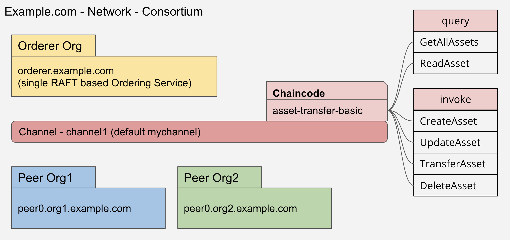

# Try the installation

## Section Overview

This section gives you an overview of the so-called Hyperledger Fabric Samples or short fabric-samples and how you can run the official test-network with a predefined Node.js chaincode.

Watch the video in this section to complete the following steps.

## Learning Objectives

By the end of this section, you will be able to:

- Understand what are the fabric-samples for.
- Understand how the offical test-network is working.
- Start the official test-network and run it using the standard Asset-Transfer-Basic (atb) chaincode implemented in Node.js.

## Overview fabric-samples
The fabric-samples represent a perfect starting point for the beginning of your fabric journey. You can use this collection of examples to get started working with HLF, explore important HLF features, and learn how to build applications that can interact with blockchain networks using the Fabric SDKs. Reference: https://github.com/hyperledger/fabric-samples

The fabric-samples cover a lot of things and use cases. In this course we focus mainly on the predefined test-network.

## Overview test-network

First, I would like to give you an overview of the test-network. Figure 2 shows the network as a whole.

<figure class="image">
  
  <figcaption>Figure 2</figcaption>
</figure>

The nest-network consortium consists of two peer organizations and one orderer organization. This is also reflected in the number of Docker containers are used.

The test-network uses the standard channel configuration and a channel called channel1. The test-network is supplied with a number of standard chaincode implementations that are available in the fabric-samples and known as **asset-transfer** in various forms. In this first test, we will use the **asset-transfer-basic** example code implemented as Node.js chaincode.

Both peer organizations consist of a single peer container and use LevelDB for their **World State** as a standard.

The orderer organization uses a single RAFT ordering system. According to the RAFT website we describe it as follows. Reference: https://raft.github.io/

>Raft is a consensus algorithm that is designed to be easy to understand. It's equivalent to Paxos in fault-tolerance and performance. The difference is that it's decomposed into relatively independent subproblems, and it cleanly addresses all major pieces needed for practical systems. We hope Raft will make consensus available to a wider audience, and that this wider audience will be able to develop a variety of higher quality consensus-based systems than are available today.

The name RAFT can be used as an acronym for **R**e {liable | plated | dundant} **A**nd **F**ault-**T**olerant. However, at the time the course was created, there was no official definition of this term available.

The **asset-transfer-basic** chaincode implementation can be broken down into two sections. One to **query** the data and another to process (**invoke**) the data in the blockchain.

Let us discuss briefly these methods.

### Methods for querying data

The chaincode provides us with two methods of querying data.

The **GetAllAssets** method returns all stored assets as a JSON array. On the other hand, the **ReadAsset** method returns a certain asset as a result and expects a transition parameter, namely the name of the asset.

We will see this methodes later in action.

### Methods for invoking data

In order to process the data in the blockchain, the chaincode provides us with four additional methods. CreateAsset, UpdateAsset, TransferAsset and finally DeleteAsset. These methods essentially do what their names express.

We will see these methodes later in action. 

At this point we can clarify two terms. The term query and invoke in the sense of HLF.

The term **Query** is used to query data from the blockchain. If you request data from the blockchain, the transaction is not sent to the ordering system, only the peer to which the request is sent is requested. That makes to query fast and efficient. 

According to the fabric documentation a query can defined as follows.
>A query is a chaincode invocation which reads the ledger current state but does not write to the ledger. The chaincode function may query certain keys on the ledger, or may query for a set of keys on the ledger. Since queries do not change ledger state, the client application will typically not submit these read-only transactions for ordering, validation, and commit. Although not typical, the client application can choose to submit the read-only transaction for ordering, validation, and commit, for example if the client wants auditable proof on the ledger chain that it had knowledge of specific ledger state at a certain point in time.

The term **Invoke** is used to process some data on the blockchain. 

According to the fabric documentation a invoke can defined as follows.
>A client application invokes chaincode by sending a transaction proposal to a peer. The peer will execute the chaincode and return an endorsed proposal response to the client application. The client application will gather enough proposal responses to satisfy an endorsement policy, and will then submit the transaction results for ordering, validation, and commit. The client application may choose not to submit the transaction results. For example if the invoke only queried the ledger, the client application typically would not submit the read-only transaction, unless there is desire to log the read on the ledger for audit purpose. The invoke includes a channel identifier, the chaincode function to invoke, and an array of arguments.

After we have received a first overview, we can test our fabric installation as a next step.

## Run your first HLF network

To test your installationen we can start interacting with the test-network. To do so we can break down this process into three steps.

1. Start the network an create a channel
2. Install the chaincode
3. Run (query/invoke) the chaincode


### Start the network
To start the network we switch into the test-network folder.

```bash
# switch to the base folder
cd fabric-samples/test-network
```

The test-network provides a central control script for starting the network, installing the chaoncode and stopping the network. This script is called network.sh and located into the test-network folder. Make yourself familiar with this script by reading the help section.

```bash
# print some help
./network.sh --help
```

Now it is time to start the network for the first time. The following command starts the network and creates the default channel named channel1.

```bash
# bring up the network and create a channel
./network.sh up createChannel
```

We can check the success of this first step by checking the running Docker containers. For this we can us the **docker-compose ps** command. All predefined docker-compose.yaml files are located in a sub-folder called docker. The default compose file is called docker-compose-test-net.yaml. We can address this file using the docker-compose ps command with the -f option.

>The Compose file is a YAML file defining services, networks, and volumes for a Docker application.

When you run the following command, you should get the following output.
```bash
# use the docker-compose ps command
docker-compose -f docker/docker-compose-test-net.yaml ps
```

```bash
         Name                Command       State                         Ports
-----------------------------------------------------------------------------------------------------
cli                      /bin/bash         Up
orderer.example.com      orderer           Up      0.0.0.0:7050->7050/tcp,:::7050->7050/tcp
peer0.org1.example.com   peer node start   Up      0.0.0.0:7051->7051/tcp,:::7051->7051/tcp
peer0.org2.example.com   peer node start   Up      7051/tcp, 0.0.0.0:9051->9051/tcp,:::9051->9051/tcp
```

As we can see there are four containers running. One for each peer, one as an ordering service and finally one CLI (command-line interface) container that can be used to interact with the fabric network.

From a developer's perspective, it is also important to know what happened behind the curtain. The network.sh script does all the work for us. But let us take a few minutes to break this down a bit. When you run the **./network.sh up createChannel** command the following tasks are executed.

1. Create all certifcates which are needed. Each node and user that interacts with a HLF network needs to belong to an organization in order to participate in the network. That is the reason why we need corresponding certificates for each network member. 
2. Create the genesis block of the network. The first block of a newly created channel is called  **genesis block**.
3. Starts the orderer, peer and cli container according to the docker-compose file.

Congratulations, you have completed this step. Now let us move on to complete this startup process by installing the chaincode.

### Install the chaincode
Because this course deals with Node.js we are going to install a Node.js based chaincode. We can use the **network.sh** script to deploy the predefined asset-transfer-basic chaincode. To do so I would like to draw your attention to the following options.

- -ccn stands for the chaincode name
- -ccp stands for the path to chaincode folder
- -ccl stands for the chaincode language, in our case we are going to use javascript which means Node.js

The following command will install the predefined chaincode into the network.

```bash
# install default CC - asset-transfer (basic) chaincode implemented in Node.js
./network.sh deployCC -ccn basic -ccp ../asset-transfer-basic/chaincode-javascript/ -ccl javascript
```

As a result you should see two runnning chaincode containers. To check this use the following commands.

```bash
# check if chaincode containers are running
docker ps | grep dev
```
You can recognize a chaincode container by its name. The name consists of the following pattern. A prefix dev, followed by the name of the associated peer and a final postfix that represents the chaincode identifier. All three parts are separated from each other by a hyphen. Every chaincode we are going to install runs in a secured Docker container isolated from the endorsing peer process. Such a container is called a chaincode-container.

```bash
dev-peer0.org2.example.com-basic_1.0-b359a077730d7f44d6a437ad49d1da951f6a01c6d1eed4f85b8b1f5a08617fe7-555e14d8a2763fe339afa55b3e3bee88d515d3624250882079ae0f30c2fdc03f
```
Congratulations, now you have finished all the steps to start the test-network. Now we are ready to have some fun with HLF let us start interacting with the network.

## Interact with the network

To interact with a running HLF network we have three posibilities. Figure 3 summarizes these:
<figure class="image">
  
  <figcaption>Figure 3</figcaption>
</figure>

Depending on your use case, you can opt for a variant. Option one is basically used for administration.

Option two - the container version - can be used if you have not installed the binaries or do not want to use them.

Finally, option three - the SDK - which is usually used for production and building a REST API to interact with the network using a front-end application, usually written in Angular or some other Javascript framework.

In this first test we use the binary version with the corresponding CLI commands in our terminal. 

One important point is that the HLF network has to know who we are. That question is answered with special environment variables which has to be exported to terminal. 

### Environment variables for Org1

The following environment variables are:

```bash
export CORE_PEER_TLS_ENABLED=true
export CORE_PEER_LOCALMSPID="Org1MSP"
export CORE_PEER_TLS_ROOTCERT_FILE=${PWD}/organizations/peerOrganizations/org1.example.com/peers/peer0.org1.example.com/tls/ca.crt
export CORE_PEER_MSPCONFIGPATH=${PWD}/organizations/peerOrganizations/org1.example.com/users/Admin@org1.example.com/msp
export CORE_PEER_ADDRESS=localhost:7051
```

We have to adjust these variables according to our test situation. If you, as Org1 user, want to interact with the HLF network, we need to set the appropriate environment variables for Org1. The same goes for Org2 if we want to interact as users from Org2.

The test-network provides script to switch easily between Org1 and Org2. The script is located in the sub-folder scripts and is called envVars.sh.

```bash
# create an env file
. scripts/envVar.sh
setGlobals 1

export FABRIC_CFG_PATH=../config
export CHANNEL_NAME=mychannel

# check env vars
printenv | grep CORE
```

### Initialize the leder (sample data)
Run the following command to initialize the ledger with assets:
```bash

# for explanation
peer chaincode invoke 
  -o localhost:7050 
  --ordererTLSHostnameOverride orderer.example.com 
  --tls 
  --cafile ${PWD}/organizations/ordererOrganizations/example.com/orderers/orderer.example.com/msp/tlscacerts/tlsca.example.com-cert.pem 
  -C $CHANNEL_NAME 
  -n basic 
  --peerAddresses localhost:7051 
  --tlsRootCertFiles ${PWD}/organizations/peerOrganizations/org1.example.com/peers/peer0.org1.example.com/tls/ca.crt 
  --peerAddresses localhost:9051 
  --tlsRootCertFiles ${PWD}/organizations/peerOrganizations/org2.example.com/peers/peer0.org2.example.com/tls/ca.crt 
  -c '{"function":"InitLedger","Args":[]}'


# for copy and paste
## binary version
peer chaincode invoke -o localhost:7050 --ordererTLSHostnameOverride orderer.example.com --tls --cafile ${PWD}/organizations/ordererOrganizations/example.com/orderers/orderer.example.com/msp/tlscacerts/tlsca.example.com-cert.pem -C $CHANNEL_NAME -n basic --peerAddresses localhost:7051 --tlsRootCertFiles ${PWD}/organizations/peerOrganizations/org1.example.com/peers/peer0.org1.example.com/tls/ca.crt --peerAddresses localhost:9051 --tlsRootCertFiles ${PWD}/organizations/peerOrganizations/org2.example.com/peers/peer0.org2.example.com/tls/ca.crt -c '{"function":"InitLedger","Args":[]}'

## cli version 
peer chaincode invoke -o orderer.example.com:7050 --ordererTLSHostnameOverride orderer.example.com --tls --cafile ${PWD}/organizations/ordererOrganizations/example.com/orderers/orderer.example.com/msp/tlscacerts/tlsca.example.com-cert.pem -C $CHANNEL_NAME -n basic --peerAddresses peer0.org1.example.com:7051 --tlsRootCertFiles ${PWD}/organizations/peerOrganizations/org1.example.com/peers/peer0.org1.example.com/tls/ca.crt --peerAddresses peer0.org2.example.com:9051 --tlsRootCertFiles ${PWD}/organizations/peerOrganizations/org2.example.com/peers/peer0.org2.example.com/tls/ca.crt -c '{"function":"InitLedger","Args":[]}'
```

### Query the leder

```bash
# Read the last state of all assets
peer chaincode query -C $CHANNEL_NAME -n basic -c '{"Args":["GetAllAssets"]}' | jq .

# Read an asset 
peer chaincode query -C $CHANNEL_NAME -n basic -c '{"Args":["ReadAsset","asset1"]}' | jq .
```

### Create an asset
```bash

peer chaincode invoke -o localhost:7050 --ordererTLSHostnameOverride orderer.example.com --tls --cafile ${PWD}/organizations/ordererOrganizations/example.com/orderers/orderer.example.com/msp/tlscacerts/tlsca.example.com-cert.pem -C $CHANNEL_NAME -n basic --peerAddresses localhost:7051 --tlsRootCertFiles ${PWD}/organizations/peerOrganizations/org1.example.com/peers/peer0.org1.example.com/tls/ca.crt --peerAddresses localhost:9051 --tlsRootCertFiles ${PWD}/organizations/peerOrganizations/org2.example.com/peers/peer0.org2.example.com/tls/ca.crt -c '{"function":"CreateAsset","Args":["asset7","green","10","Roland","500"]}'
```

### Update an asset
```bash
peer chaincode invoke -o localhost:7050 --ordererTLSHostnameOverride orderer.example.com --tls --cafile ${PWD}/organizations/ordererOrganizations/example.com/orderers/orderer.example.com/msp/tlscacerts/tlsca.example.com-cert.pem -C $CHANNEL_NAME -n basic --peerAddresses localhost:7051 --tlsRootCertFiles ${PWD}/organizations/peerOrganizations/org1.example.com/peers/peer0.org1.example.com/tls/ca.crt --peerAddresses localhost:9051 --tlsRootCertFiles ${PWD}/organizations/peerOrganizations/org2.example.com/peers/peer0.org2.example.com/tls/ca.crt -c '{"function":"UpdateAsset","Args":["asset7","green","10","Roland","600"]}'
```

### Transfer an asset
```bash
peer chaincode invoke -o localhost:7050 --ordererTLSHostnameOverride orderer.example.com --tls --cafile ${PWD}/organizations/ordererOrganizations/example.com/orderers/orderer.example.com/msp/tlscacerts/tlsca.example.com-cert.pem -C $CHANNEL_NAME -n basic --peerAddresses localhost:7051 --tlsRootCertFiles ${PWD}/organizations/peerOrganizations/org1.example.com/peers/peer0.org1.example.com/tls/ca.crt --peerAddresses localhost:9051 --tlsRootCertFiles ${PWD}/organizations/peerOrganizations/org2.example.com/peers/peer0.org2.example.com/tls/ca.crt -c '{"function":"TransferAsset","Args":["asset7","Joana"]}'
```

### Delete an asset
```bash
peer chaincode invoke -o localhost:7050 --ordererTLSHostnameOverride orderer.example.com --tls --cafile ${PWD}/organizations/ordererOrganizations/example.com/orderers/orderer.example.com/msp/tlscacerts/tlsca.example.com-cert.pem -C $CHANNEL_NAME -n basic --peerAddresses localhost:7051 --tlsRootCertFiles ${PWD}/organizations/peerOrganizations/org1.example.com/peers/peer0.org1.example.com/tls/ca.crt --peerAddresses localhost:9051 --tlsRootCertFiles ${PWD}/organizations/peerOrganizations/org2.example.com/peers/peer0.org2.example.com/tls/ca.crt -c '{"function":"DeleteAsset","Args":["asset1"]}'
```

### Switch to peer Org2
We can switch to work with peer Org2 peer0.org2.example.com with changeing the following evironment variables. 
```bash 

# create an env file
setGlobals 2
```

## Bring down the network
```bash
./network.sh down
```
[Index](./index.md)