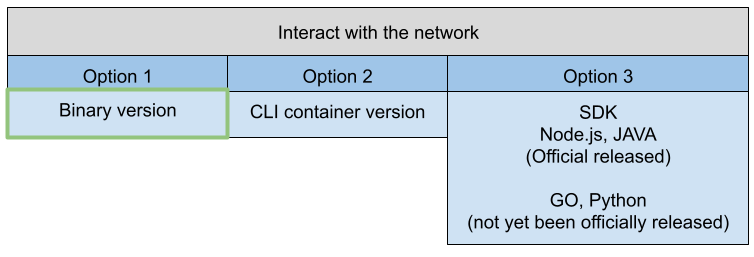

# Try the Installation

## Section Overview

This section gives you an overview of the so-called Hyperledger Fabric Samples - short fabric-samples - and how you can run the official test-network with a predefined Node.js chaincode.

Watch the video in this section to complete the following steps.

## Learning Objectives

By the end of this section you will be able to:

- Understand what are the fabric-samples for.
- Understand how the offical test-network is working.
- Start the official test-network and run it by using the standard Asset-Transfer-Basic (atb) chaincode implemented in Node.js.

## Overview of fabric-samples
The fabric-samples represent a perfect starting point for the beginning of your fabric journey. You can use this collection of examples to start working with HLF, to explore important HLF features, and to learn how to build applications that can interact with blockchain networks using the Fabric SDKs. Reference: https://github.com/hyperledger/fabric-samples

The fabric-samples cover a lot of things and use cases. In this course we focus mainly on the predefined test-network.

## Overview of the test-network

Figure 2 shows the network as a whole.

<figure class="image">
  
  <figcaption>Figure 2</figcaption>
</figure>

The test-network consortium consists of two peer organizations and one orderer organization. This is also reflected in the number of Docker containers used.

The test-network uses the standard channel configuration and a channel called channel1. The test-network is supplied with a number of standard chaincode implementations that are available in the fabric-samples and known as **asset-transfer** in various forms. In this first test we use the **asset-transfer-basic** example code implemented as Node.js chaincode.

Both peer organizations consist of a single peer container and use LevelDB as a standard for their **World State**.

The orderer organization uses a single RAFT ordering system. According to the RAFT website it is described as follows. Reference: https://raft.github.io/

>Raft is a consensus algorithm that is designed to be easy to understand. It is equivalent to Paxos in fault-tolerance and performance. The difference is that it is decomposed into relatively independent subproblems, and it cleanly addresses all major pieces needed for practical systems. Raft makes consensus available to a wider audience, and this wider audience will be able to develop a variety of higher quality consensus-based systems.

The name RAFT can be used as an acronym for **R**e {liable | plated | dundant} **A**nd **F**ault-**T**olerant. However, at the time the course was created, there is no official definition of this term available.

The **asset-transfer-basic** chaincode implementation can be broken down into two sections -oOne to **query** the data and another to process (**invoke**) the data in the blockchain.

Let us discuss these methods briefly .

### Methods for Querying Data

The chaincode provides two methods of querying data.

The **GetAllAssets** method returns all stored assets as a JSON array. The **ReadAsset** method returns a certain asset as a result and expects a transition parameter, namely the name of the asset.

You will see these methods later in action.

### Methods for Invoking Data

In order to process the data in the blockchain, the chaincode provides four additional methods: CreateAsset, UpdateAsset, TransferAsset, and DeleteAsset. These methods essentially do what their names express.

You will see these methods later in action. 

Query and invoke in terms of HLF are described as follows.

The term **Query** is used to query data from the blockchain. If you request data from the blockchain, the transaction is not sent to the ordering system. Only the peer to which the request is sent is requested. That makes the query fast and efficient. 

According to the fabric documentation a query can be defined as follows.
>A query is a chaincode invocation which reads the ledger current state but does not write to the ledger. The chaincode function may query certain keys on the ledger, or may query for a set of keys on the ledger. Since queries do not change ledger state, the client application will typically not submit these read-only transactions for ordering, validation, and commit. Although not typical, the client application can choose to submit the read-only transaction for ordering, validation, and commit, for example if the client wants auditable proof on the ledger chain that it had knowledge of specific ledger state at a certain point in time.

The term **Invoke** is used to process some data on the blockchain. 

According to the fabric documentation an invoke can bedefined as follows.
>A client application invokes chaincode by sending a transaction proposal to a peer. The peer will execute the chaincode and return an endorsed proposal response to the client application. The client application will gather enough proposal responses to satisfy an endorsement policy, and will then submit the transaction results for ordering, validation, and commit. The client application may choose not to submit the transaction results. For example if the invoke only queried the ledger, the client application typically would not submit the read-only transaction, unless there is desire to log the read on the ledger for audit purpose. The invoke includes a channel identifier, the chaincode function to invoke, and an array of arguments.

As a next step you can test your fabric installation.

## Run your First HLF Network

To test your installation start interacting with the test-network by breaking down this process into three steps.

1. Start the network and create a channel
2. Install the chaincode
3. Run (query/invoke) the chaincode

### Start the Network
To start the network switch into the test-network folder.

```bash
# switch to the base folder
cd fabric-samples/test-network
```

The test-network provides a central control script for starting the network, installing the chaincode and stopping the network. This script is called network.sh and is located in the test-network folder. Make yourself familiar with this script by reading the help section.

```bash
# print some help
./network.sh --help
```

Whith the following command you start the network for the first time and create the default channel named channel1.

```bash
# bring up the network and create a channel
./network.sh up createChannel
```

Check the success of this first step by checking the running Docker containers. For that, use the **docker-compose ps** command. All predefined docker-compose.yaml files are located in a sub-folder called docker. The default compose file is called docker-compose-test-net.yaml. Address this file by using the docker-compose ps command with the -f option.

>The compose file is a YAML file defining services, networks, and volumes for a Docker application.

When you run the following command, you should get the following output.
```bash
# use the docker-compose ps command
docker-compose -f docker/docker-compose-test-net.yaml ps
```

```bash
         Name                Command       State                         Ports
-----------------------------------------------------------------------------------------------------
cli                      /bin/bash         Up
orderer.example.com      orderer           Up      0.0.0.0:7050->7050/tcp,:::7050->7050/tcp
peer0.org1.example.com   peer node start   Up      0.0.0.0:7051->7051/tcp,:::7051->7051/tcp
peer0.org2.example.com   peer node start   Up      7051/tcp, 0.0.0.0:9051->9051/tcp,:::9051->9051/tcp
```

As you can see there are four containers running - one for each peer, one as an ordering service and finally one CLI (command-line interface) container that can be used to interact with the fabric network.

For a developer it is also important to know what happened behind the curtain. The network.sh script does all the work. Take a few minutes to break this down. When you run the **./network.sh up createChannel** command the following tasks are executed.

1. Create all certifcates which are needed. Each node and user that interacts with a HLF network belongs to an organization in order to participate in the network. That is the reason why a corresponding certificate for each network member is needed. 
2. Create the genesis block of the network. The first block of a newly created channel is called **genesis block**.
3. Start the orderer, peer and cli container according to the docker-compose file.

Congratulations! You have started the network. Now, move on to complete the startup process by installing the chaincode.

### Install the Chaincode
For this course install a Node.js based chaincode.Use the **network.sh** script to deploy the predefined asset-transfer-basic chaincode. For that, you have the following options.

- -ccn stands for the chaincode name
- -ccp stands for the path to chaincode folder
- -ccl stands for the chaincode language, for this course use javascript which means Node.js

The following command will install the predefined chaincode into the network.

```bash
# install default CC - asset-transfer (basic) chaincode implemented in Node.js
./network.sh deployCC -ccn basic -ccp ../asset-transfer-basic/chaincode-javascript/ -ccl javascript
```

As a result you should see two runnning chaincode containers. To check this, use the following commands.

```bash
# check if chaincode containers are running
docker ps | grep dev
```
You can recognize a chaincode container by its name. The name consists of the following pattern: a prefix dev, followed by the name of the associated peer, and a final postfix that represents the chaincode identifier. All three parts are separated from each other by a hyphen. Every chaincode you are going to install runs in a secured Docker container isolated from the endorsing peer process. Such a container is called a chaincode-container.

```bash
dev-peer0.org2.example.com-basic_1.0-b359a077730d7f44d6a437ad49d1da951f6a01c6d1eed4f85b8b1f5a08617fe7-555e14d8a2763fe339afa55b3e3bee88d515d3624250882079ae0f30c2fdc03f
```
Congratulations! Now you have finished all the steps to start the test-network. Start interacting with the network and have some fun with HLF!

## Interact with the Network

To interact with a running HLF network you have three posibilities. Figure 3 summarizes them:
<figure class="image">
  
  <figcaption>Figure 3</figcaption>
</figure>

Depending on your use case, you can opt for a variant. Option one is basically used for administration. You can find the available binaries in the bin subfolder of the fabric samples.

Option two - the container version - can be used if the binaries are not installed or not used, e.g. in a Kubernetes environment.

Finally, option three - the SDK -is used for production and building a REST API to interact with the network using a frontend application, usually written in Angular or some other Javascript framework of your choice.

In this first test use the binary version with the corresponding CLI commands in your terminal to interact with the test-network. 

Important note: The HLF network has to know who you are. That question is answered with special environment variables which has to be exported to terminal. 

### Environment Variables for Org1

Set the following five environment variables to interact with the test-network.

Split these variables into three blocks - one to enable TLS and another to express which user wants to interact with the network.

```bash
# enable TLS
export CORE_PEER_TLS_ENABLED=true
export CORE_PEER_TLS_ROOTCERT_FILE=${PWD}/organizations/peerOrganizations/org1.example.com/peers/peer0.org1.example.com/tls/ca.crt

# who you are
export CORE_PEER_LOCALMSPID="Org1MSP"
export CORE_PEER_MSPCONFIGPATH=${PWD}/organizations/peerOrganizations/org1.example.com/users/Admin@org1.example.com/msp

# to which peer you would like to connect
export CORE_PEER_ADDRESS=localhost:7051
```
Let's go over these variables briefly. 

TLS is activated by default in the test network. Therefore, you need the first two environment variables. The first variable enables TLS for the client and the second refers to the TLS root certificate for Org1.

```bash
# enable TLS
export CORE_PEER_TLS_ENABLED=true
export CORE_PEER_TLS_ROOTCERT_FILE=${PWD}/organizations/peerOrganizations/org1.example.com/peers/peer0.org1.example.com/tls/ca.crt
```

HLF is a permissioned blockchain system. To gain access, you need to express who wants to interact with the system. This is basically done with the following two variables.

**CORE_PEER_LOCALMSPID** represents the Membership Service Provider (MSP) and **CORE_PEER_MSPCONFIGPATH** will reference to the Org1 crypto material in the organizations folder.

```bash
# who you are
export CORE_PEER_LOCALMSPID="Org1MSP"
export CORE_PEER_MSPCONFIGPATH=${PWD}/organizations/peerOrganizations/org1.example.com/users
```

The variable **CORE_PEER_ADDRESS** expresses the peer address to which you are going to connect.
```bash
# to which peer you would like to connect
export CORE_PEER_ADDRESS=localhost:7051
```

You have to adjust these variables according to your test situation. If you as Org1 user want to interact with the HLF network, you need to set the appropriate environment variables for Org1. The same applies for Org2 if you want to interact as user from Org2.

The test-network provides script to switch easily between Org1 and Org2. The script is located in the sub-folder scripts and is called envVars.sh.

To set the right variables execute the script to make the functions inside the script available to the bash and then execute the setGlobals function. 

The setGlobals function expects one parameter. This parameter could be 1 or 2. The value 1 represents Org1 and value 2 is for Org2.

If you want to interact with the network as an user from Org1, then call setGlobals 1. If you want to test as a user from Org2 you can switch with setGlobals 2.

> Note: You are still in out base folder fabric-samples.

One final topic you have to consider. Fabric needs to know where the configuration files are. This is expressed with the variable **FABRIC_CFG_PATH**. In the fabric samples there is a central configuration folder directly in the fabric samples. There you can find the configuration file for a peer node (core.yaml) and for an orderer node (orderer.yaml).

And finally, for simplification export a helper variable **CHANNEL_NAME** for the name of the used channel. 

Know you can check your exported environment variables with the **printenv** or **env** bash command and filter the result with a **grep** command. 

>The printenv command in Linux provides the ability to view all or a part of the environment.

>Grep is an acronym for Global Regular Expression Print. It is a command-line tool used to search for a string of characters in a specified file or result. 

```bash
# execute the script
. scripts/envVar.sh

# use the setGlobls function from the script
setGlobals 1

# path to the config folder like core.yaml or orderer.yaml
export FABRIC_CFG_PATH=../config

# set the default channel name for our test
export CHANNEL_NAME=mychannel

# check some environment vars
printenv | grep CORE
```

Know it is time to interact with the network.

### Use the Sample Chaincode

To use the sample chaincode break the steps down as follows.

1. Initialize the ledger with sample data.
2. Query an asset.
3. Create a new asset.
4. Update an existing asset.
5. Delete an existing asset.

To interact with the network from the command line you need a special command **peer chaincode**. The **peer chaincode** command allows administrators to perform chaincode related operations on a peer, such as installing, instantiating, invoking, packaging, querying, and upgrading chaincode.

This command provides a number of subcommands. For now, you need to call the subcommands **invoke** and **query**.

> Note: Use the invoke command every time you want to change an asset. Use the query command in case you want to read data from a specific peer.

### Initialize the Ledger

To get started with the chaincode the developer of the chaincode has provided an initialize function called **InitLedger**. Call this initialize function to setup the chaincode.

Run the following command to initialize the ledger with a couple of assets. The command below has to be executed. It looks very long and uses some options. Let's break it down for a better understanding.

```bash

# the command with its options
peer chaincode invoke 
  # define the orderer node
  -o localhost:7050 

  # define the TLS communication
  --ordererTLSHostnameOverride orderer.example.com 
  --tls 
  --cafile ${PWD}/organizations/ordererOrganizations/example.com/orderers/orderer.example.com/msp/tlscacerts/tlsca.example.com-cert.pem 
  
  # define the channel and the chaincode name you are going to use
  -C $CHANNEL_NAME 
  -n basic 
  
  # define the peers you have to use according to the used endorsement policy
  # you need at least one peer of both organizations
  --peerAddresses localhost:7051 
  --tlsRootCertFiles ${PWD}/organizations/peerOrganizations/org1.example.com/peers/peer0.org1.example.com/tls/ca.crt 
  --peerAddresses localhost:9051 
  --tlsRootCertFiles ${PWD}/organizations/peerOrganizations/org2.example.com/peers/peer0.org2.example.com/tls/ca.crt 
  
  # finally, the chaincode function you are going to call
  -c '{"function":"InitLedger","Args":[]}'
```

Use the following snippet for copy and paste.
```bash
# for copy and paste
## binary version
peer chaincode invoke -o localhost:7050 --ordererTLSHostnameOverride orderer.example.com --tls --cafile ${PWD}/organizations/ordererOrganizations/example.com/orderers/orderer.example.com/msp/tlscacerts/tlsca.example.com-cert.pem -C $CHANNEL_NAME -n basic --peerAddresses localhost:7051 --tlsRootCertFiles ${PWD}/organizations/peerOrganizations/org1.example.com/peers/peer0.org1.example.com/tls/ca.crt --peerAddresses localhost:9051 --tlsRootCertFiles ${PWD}/organizations/peerOrganizations/org2.example.com/peers/peer0.org2.example.com/tls/ca.crt -c '{"function":"InitLedger","Args":[]}'
```

If you see a console message like the following, you have successfully completed your first chaincode action. Congratulations! This is a big step.

```bash
2021-04-21 11:50:25.130 CEST [chaincodeCmd] chaincodeInvokeOrQuery -> INFO 001 Chaincode invoke successful. result: status:200
```

### Query the Ledger

As you have saved assets now on your channel, you can query them. To query the assets the chaincode provides two methods: GetAllAssets and ReadAsset. Either method can be used with the command **peer chaincode** and subcommand **query**. Test the following examples.

```bash
# read the latest status of all existing assets
peer chaincode query -C $CHANNEL_NAME -n basic -c '{"Args":["GetAllAssets"]}' | jq .
```

```bash
# read an particular asset e.g. asset1
peer chaincode query -C $CHANNEL_NAME -n basic -c '{"Args":["ReadAsset","asset1"]}' | jq .
```

Feel free to play with the following chaincode functions.

- CreateAsset
- UpdateAsset
- TransferAsset and 
- DeleteAsset

Since this method always changes the status of an asset, use the **invoke** subcommand. The command as a whole is the same as in the **CreateAsset** example, only the **-c option** changes.

### Create a New Asset
The asset in the chaincode represents a JavaScript object and the structure of this object can be described as follows:

```javascript
asset = {
  ID: String,
  Color: String,
  Size: Integer,
  Owner: String,
  AppraisedValue: Integer
}
```

With this in mind,pass the values of an asset to the chaincode function. Now it is time to have a deeper look at the **-c option**. The -c option expects a JSON-formatted string with two properties: Function and Arguments. The Function property is a string that represents the name of the chaincode function to be called. The Args property is an array of strings that will be passed to the chaincode function.

Let's try to create a new asset.

```bash
# create a new asset
peer chaincode invoke -o localhost:7050 --ordererTLSHostnameOverride orderer.example.com --tls --cafile ${PWD}/organizations/ordererOrganizations/example.com/orderers/orderer.example.com/msp/tlscacerts/tlsca.example.com-cert.pem -C $CHANNEL_NAME -n basic --peerAddresses localhost:7051 --tlsRootCertFiles ${PWD}/organizations/peerOrganizations/org1.example.com/peers/peer0.org1.example.com/tls/ca.crt --peerAddresses localhost:9051 --tlsRootCertFiles ${PWD}/organizations/peerOrganizations/org2.example.com/peers/peer0.org2.example.com/tls/ca.crt -c '{"function":"CreateAsset","Args":["asset10","green","10","Roland","500"]}'
```

If you see a console message like the following, you have successfully created a new asset.

```bash
2021-04-21 16:38:20.892 CEST [chaincodeCmd] chaincodeInvokeOrQuery -> INFO 001 Chaincode invoke successful. result: status:200 payload:"{\"ID\":\"asset10\",\"Color\":\"green\",\"Size\":\"10\",\"Owner\":\"Roland\",\"AppraisedValue\":\"500\"}"
```

The next try is to update the brand new asset.

### Update anAasset

The **UpdateAsset** command looks essentially the same as the **CreateAsset** command. The only difference is that the chaincode function checks internally whether the asset is present. If so, an update on this asset will be performed. An update means that a new version of the asset - also known as a new state - will be created.

```bash
peer chaincode invoke -o localhost:7050 --ordererTLSHostnameOverride orderer.example.com --tls --cafile ${PWD}/organizations/ordererOrganizations/example.com/orderers/orderer.example.com/msp/tlscacerts/tlsca.example.com-cert.pem -C $CHANNEL_NAME -n basic --peerAddresses localhost:7051 --tlsRootCertFiles ${PWD}/organizations/peerOrganizations/org1.example.com/peers/peer0.org1.example.com/tls/ca.crt --peerAddresses localhost:9051 --tlsRootCertFiles ${PWD}/organizations/peerOrganizations/org2.example.com/peers/peer0.org2.example.com/tls/ca.crt -c '{"function":"UpdateAsset","Args":["asset10","green","10","Roland","600"]}'
```

If you see a console message like the following, you have successfully updated asset10.
```bash
2021-04-21 16:49:37.373 CEST [chaincodeCmd] chaincodeInvokeOrQuery -> INFO 001 Chaincode invoke successful. result: status:200 payload:"{\"type\":\"Buffer\",\"data\":[]}"
```

At this point you can check the state of the asset10. Use the **peer chaincode query** command. What do you see?

```bash
peer chaincode query -C $CHANNEL_NAME -n basic -c '{"Args":["ReadAsset","asset10"]}' | jq .
```

### Transfer an Asset
The **asset-transfer-basic** chaincode also provides a method of transferring an asset from one user to another. Of course, this is just an example. The user who owns the asset is just a name stored as a string and no cryptographic security or certificates are involved. Let's transfer the new asset10 to another user. 

Copy and paste the following snippet to your terminal.

```bash
peer chaincode invoke -o localhost:7050 --ordererTLSHostnameOverride orderer.example.com --tls --cafile ${PWD}/organizations/ordererOrganizations/example.com/orderers/orderer.example.com/msp/tlscacerts/tlsca.example.com-cert.pem -C $CHANNEL_NAME -n basic --peerAddresses localhost:7051 --tlsRootCertFiles ${PWD}/organizations/peerOrganizations/org1.example.com/peers/peer0.org1.example.com/tls/ca.crt --peerAddresses localhost:9051 --tlsRootCertFiles ${PWD}/organizations/peerOrganizations/org2.example.com/peers/peer0.org2.example.com/tls/ca.crt -c '{"function":"TransferAsset","Args":["asset10","Joana"]}'
```

If you see a console message like the following, you have successfully transfered asset10.
```bash
2021-04-22 10:58:50.592 CEST [chaincodeCmd] chaincodeInvokeOrQuery -> INFO 001 Chaincode invoke successful. result: status:200 payload:"{\"type\":\"Buffer\",\"data\":[]}"
```

Now you can check again the state of the asset10. Use the **peer chaincode query** command. What do you see?

```bash
peer chaincode query -C $CHANNEL_NAME -n basic -c '{"Args":["ReadAsset","asset10"]}' | jq .
```

### Delete an Asset
You are curious how you can delete an asset from the blockchain? Well this should not work per design because a blockchain is immutable. The history of an asset is not deleted, only the world status of the transferred key is deleted.

Let's test it with the following snippet.

```bash
peer chaincode invoke -o localhost:7050 --ordererTLSHostnameOverride orderer.example.com --tls --cafile ${PWD}/organizations/ordererOrganizations/example.com/orderers/orderer.example.com/msp/tlscacerts/tlsca.example.com-cert.pem -C $CHANNEL_NAME -n basic --peerAddresses localhost:7051 --tlsRootCertFiles ${PWD}/organizations/peerOrganizations/org1.example.com/peers/peer0.org1.example.com/tls/ca.crt --peerAddresses localhost:9051 --tlsRootCertFiles ${PWD}/organizations/peerOrganizations/org2.example.com/peers/peer0.org2.example.com/tls/ca.crt -c '{"function":"DeleteAsset","Args":["asset10"]}'
```

If you see a console message like the following, you have successfully deleted asset10 from world state.
```bash
2021-04-22 11:09:12.600 CEST [chaincodeCmd] chaincodeInvokeOrQuery -> INFO 001 Chaincode invoke successful. result: status:200 payload:"{\"type\":\"Buffer\",\"data\":[]}"
```

Now you can finally check the status of asset10.

```bash
peer chaincode query -C $CHANNEL_NAME -n basic -c '{"Args":["ReadAsset","asset10"]}' | jq .
```

If you get the following error, your asset is removed from the world state.
```bash
Error: endorsement failure during query. response: status:500 message:"error in simulation: transaction returned with failure: Error: The asset asset10 does not exist"
```

Congratulations! You have successfully tested the predefined chaincode. Try to recap all the steps and play around with the chaincode.

Note, there is one more issue: The test-network consists of two organizations. How can you test the state of an asset of the second organization?

### Switch to peer0 from Org2
You can switch to work with peer per0.org2.example.com from Org2 by changing your environment variables. For that, use the **setGlobals** function again. 

```bash 
# switch to Org2
setGlobals 2
```
Now you are part of Org2 and you can test the chaincode from the Org2 point's of view. A final test is:

- Create an asset from Org2
- Switch to Org1 and
- Check if the asset exists also from Org1


## Bring Down the Network
You can stop the network by using the following command.

> Note: If you shut down the network all your data and Docker container images will be deleted. After that step you will have a clean setup to start again.

```bash
./network.sh down
```
[Index](./index.md)
