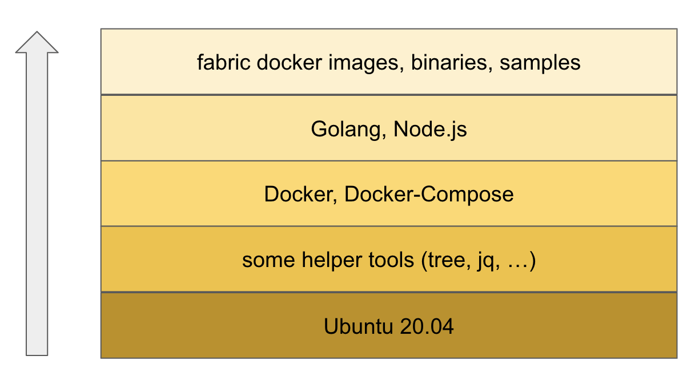

# Hyperledger Fabric (HLF) Installation
Below you can find the detailed step by steps instructions for installating a HLF system according to the official HLF documentation.

Watch the video in this chapter to complete the following steps.

## Setup
These steps describe a HLF 2.2.x installation on an Ubuntu 20.04 operating system.

First, I would like to give you an overview of the installation steps. We can divide the installation process into 5 steps. Figure 1 shows these steps as a whole.

<figure class="image">
  
  <figcaption>Figure 1</figcaption>
</figure>

After finishing these steps you will have a ready HLF Installation and a running test-network.

## Preparations
### Droplet or virtuel private server 
In this course we will use a so called Digital Ocean Droplet with the following configuration: 1 CPU, 2 GB, 50 GB SSD. This server setup should be sufficient to perform all of the examples in this course.

If your are more familare with a VirtualBox setup then you are good to go as well. The starting point for the installation is in any case a basic installation of Ubuntu 20.04.

### System update
The following steps are required to prepare your ubuntu system for the HLF installation process. Let's discuss the steps in detail. 

First, we do a system update. Open a terminal and make sure you are working as root user.

```bash
# update the OS
apt update && apt upgrade
```

Second, we install some helper tools. The tools are tree, jq, gcc and make. 

The bash **tree** command is used to display the contents of any desired directory of your computer system in the form of a tree structure. This is helpful to inspect the content of a folder. 

According to the **jq** homepage, jq is like sed for JSON data - you can use it to slice and filter and map and transform structured data with the same ease that sed, awk, grep and friends let you play with text. In our example we can use jq to parse the json response from our blockchain to get to get a nicely formatted output in the terminal.

Finally the command line tools **gcc and make** are needed to install the Fabric Node.js SDK to interact with the Fabric system e.g. if you want to query a peer or invoke some transaction. 

```bash
# install some useful helpers
apt install tree jq gcc make
```
The third and final step is to setup the right timezone according your needs. Because the authors of this course are located in Austria we set the timezone to Europe/Vienna. Feel free to set the timezone according your needs. If your unsure what is the correct timezone check the **timedatectl list-timezones** command for a list of possible timezones and pick the right one.

```bash
# setup the correct timezone to fit your needs
timedatectl set-timezone Europe/Vienna

# check the time
timedatectl
```
Now that we have completed the system prep, we can move on to the next important item. The Docker installation.

### Install Docker
HLF is basically build on **Docker** images, but there is also a way to use binaries. For the purposes of this course, we will use the prepared Docker images. The foundation for that is running a **Docker** host on your operation system. 

>Docker is an open platform for developing, shipping, and running applications. Docker enables you to separate your applications from your infrastructure so you can deliver software quickly.

Use the commands below and step by step copy and paste these into your terminal to install Docker for Ubuntu 20.04. Reference: https://docs.docker.com/engine/install/ubuntu/

```bash
# set up the repository
apt install \
  apt-transport-https \
  ca-certificates \
  curl \
  gnupg-agent \
  software-properties-common

# add Docker’s official GPG key
curl -fsSL https://download.docker.com/linux/ubuntu/gpg | apt-key add -

# set up the stable repository
add-apt-repository \
  "deb [arch=amd64] https://download.docker.com/linux/ubuntu \
  $(lsb_release -cs) \
  stable"

# install docker engine
apt update
apt install docker-ce docker-ce-cli containerd.io

# check the docker version
docker --version
```
If you see a output similar like **Docker version 20.10.5, build xxx** you have successfully installed Docker.

Congratulations at this point you have successfully installed Docker on your linux box.

### Install Docker Compose

>**Compose** is a tool for defining and running multi-container Docker applications. With **Compose**, we use a YAML file to configure our Fabric network.

Use the commands below and step by step copy and paste these into your terminal to install Docker Compose. Reference https://docs.docker.com/compose/install/

```bash
# install docker-compose
curl -L "https://github.com/docker/compose/releases/download/1.29.0/docker-compose-$(uname -s)-$(uname -m)" -o /usr/local/bin/docker-compose

# apply executable permissions to the binary
chmod +x /usr/local/bin/docker-compose

# check the docker-compose version
docker-compose --version
```
If you see a output like **docker-compose version 1.29.0, build xxxx** you have successfully installed Docker Compose.

Congratulations at this point you have also successfully installed Docker Compose on your linux box. We are now ready to use Docker and Docker Compose for our HLF journey.

### Install Go Programming Language

HLF uses the Go Programming Language for many of its components. 

>Go is an open source programming language that makes it easy to build simple, reliable, and efficient software. 

Although this course is based on Node.js for chaincode as well as for client development, we should install **Go** on our training machine.

Use the commands below and step by step copy and paste these into your terminal to install Go. For this we follow the official documentation. Referene https://golang.org/doc/install

First, we download and unzip the go binary for our system. 
```bash 
# download and extract go
# latest version 08.04.21 1.14.9
rm -rf /usr/local/go && tar -C /usr/local -xzf go1.14.9.linux-amd64.tar.gz
```

Second, we add the path **/usr/local/go/bin** to the PATH environment variable.
```bash
# add the go binary to the path
echo 'export PATH="$PATH:/usr/local/go/bin:"' >> $HOME/.profile
```

Third, to apply the changes immediately, just run the shell command **source $HOME/.profile**.
```bash
# reload the profile
source $HOME/.profile
```

Now we can check the go version.
```bash
# check the go version
go version
```

If you see a output like **go version go1.14.15 linux/amd64** you have successfully installed Go.

### Install Node.js
In this course we uses Node.js for chaincode and client development. According to the HLF documentation Node.js version 1.12.x is required.

>Node.js is a JavaScript runtime built on Chrome's V8 JavaScript engine.

Use the commands below and step by step copy and paste these into your terminal to install Node.js.

First, download the install script.
```bash
# add PPA from NodeSource
curl -sL https://deb.nodesource.com/setup_12.x -o nodesource_setup.sh
```

Second, execute the script. The script will prepare the apt source on your ubuntu maschine to install Node.js via the ubuntu default install tool apt.

>**Note**: The period (dot) is short hand for the bash built in source. It will read and execute commands from a file in the current environment and return the exit status of the last command executed. It does not need to be executable.

```bash
# execute the install script
. nodesource_setup.sh
```

Third, install Node.js. 

>**Note**: What is the meaning of -y ? Automatic yes to prompts; assume "yes" as answer to all prompts and run non-interactively. 

```bash
# install node.js
apt install -y nodejs
```

Finally check the installed Node.js version.
```bash
# check the version
node -v
```

If you see a output like **v12.22.1** you have successfully installed Node.js.

At this point we have made all preparations to finally install HLF.

## Install and test Fabric Samples, Binaries and Docker Images

```bash
mkdir fabric
cd fabric

# install the latest production release from the 1.4.x branch
# we use 2.2 in our examples
curl -sSL https://bit.ly/2ysbOFE | bash -s -- 2.2.1 1.4.9

# check downloaded images
docker images

# check the bin cmd
peer version
```

## Try the installation
The fabric-samples provisions a sample HLF test-network consisting of two organizations, each maintaining one peer nodes. It also will deploy a single RAFT ordering service by default. 

To test your installationen we can start interacting with the network.

```bash
# switch to the base folder
cd fabric-samples/test-network

# print some help
./network.sh --help

# bring up the network
./network.sh up createChannel -c channel1

# install default CC - asset-transfer (basic) chaincode
./network.sh deployCC -c channel1

# show if some containers are running
docker ps
docker-compose -f docker/docker-compose-test-net.yaml ps
```

## Interacting with the network

tmux control
```bash
# start a new tmux session
tmux new -s fabric

# attach to existing session
tmux add -t fabric

# show all logs
docker-compose -f docker/docker-compose-test-net.yaml logs -f -t

# open a new panel
CTRL + b (release pressed keys) + \""

# jump between panels
CTRL + b + q 1

# detach from session
CTRL + b + d

```

## Environment variables for peer Org1

```bash
# create an env file
. scripts/envVars.sh
setGlobals 1

# check env vars
printenv | grep CORE
```

## Initialize the leder (sample data)
Run the following command to initialize the ledger with assets:
```bash

# for explanation
peer chaincode invoke 
  -o localhost:7050 
  --ordererTLSHostnameOverride orderer.example.com 
  --tls 
  --cafile ${PWD}/organizations/ordererOrganizations/example.com/orderers/orderer.example.com/msp/tlscacerts/tlsca.example.com-cert.pem 
  -C $CHANNEL_NAME 
  -n basic 
  --peerAddresses localhost:7051 
  --tlsRootCertFiles ${PWD}/organizations/peerOrganizations/org1.example.com/peers/peer0.org1.example.com/tls/ca.crt 
  --peerAddresses localhost:9051 
  --tlsRootCertFiles ${PWD}/organizations/peerOrganizations/org2.example.com/peers/peer0.org2.example.com/tls/ca.crt 
  -c '{"function":"InitLedger","Args":[]}'


# for copy and paste
peer chaincode invoke -o localhost:7050 --ordererTLSHostnameOverride orderer.example.com --tls --cafile ${PWD}/organizations/ordererOrganizations/example.com/orderers/orderer.example.com/msp/tlscacerts/tlsca.example.com-cert.pem -C $CHANNEL_NAME -n basic --peerAddresses localhost:7051 --tlsRootCertFiles ${PWD}/organizations/peerOrganizations/org1.example.com/peers/peer0.org1.example.com/tls/ca.crt --peerAddresses localhost:9051 --tlsRootCertFiles ${PWD}/organizations/peerOrganizations/org2.example.com/peers/peer0.org2.example.com/tls/ca.crt -c '{"function":"InitLedger","Args":[]}'
```

## Query the leder

```bash
# Read the last state of all assets
peer chaincode query -C $CHANNEL_NAME -n basic -c '{"Args":["GetAllAssets"]}' | jq .

# Read an asset 
peer chaincode query -C $CHANNEL_NAME -n basic -c '{"Args":["ReadAsset","asset1"]}' | jq .
```

## Create an asset
```bash

peer chaincode invoke -o localhost:7050 --ordererTLSHostnameOverride orderer.example.com --tls --cafile ${PWD}/organizations/ordererOrganizations/example.com/orderers/orderer.example.com/msp/tlscacerts/tlsca.example.com-cert.pem -C $CHANNEL_NAME -n basic --peerAddresses localhost:7051 --tlsRootCertFiles ${PWD}/organizations/peerOrganizations/org1.example.com/peers/peer0.org1.example.com/tls/ca.crt --peerAddresses localhost:9051 --tlsRootCertFiles ${PWD}/organizations/peerOrganizations/org2.example.com/peers/peer0.org2.example.com/tls/ca.crt -c '{"function":"CreateAsset","Args":["asset7","green","10","Roland","500"]}'
```

## Update an asset
```bash
peer chaincode invoke -o localhost:7050 --ordererTLSHostnameOverride orderer.example.com --tls --cafile ${PWD}/organizations/ordererOrganizations/example.com/orderers/orderer.example.com/msp/tlscacerts/tlsca.example.com-cert.pem -C $CHANNEL_NAME -n basic --peerAddresses localhost:7051 --tlsRootCertFiles ${PWD}/organizations/peerOrganizations/org1.example.com/peers/peer0.org1.example.com/tls/ca.crt --peerAddresses localhost:9051 --tlsRootCertFiles ${PWD}/organizations/peerOrganizations/org2.example.com/peers/peer0.org2.example.com/tls/ca.crt -c '{"function":"UpdateAsset","Args":["asset7","green","10","Roland","600"]}'
```

## Transfer an asset
```bash
peer chaincode invoke -o localhost:7050 --ordererTLSHostnameOverride orderer.example.com --tls --cafile ${PWD}/organizations/ordererOrganizations/example.com/orderers/orderer.example.com/msp/tlscacerts/tlsca.example.com-cert.pem -C $CHANNEL_NAME -n basic --peerAddresses localhost:7051 --tlsRootCertFiles ${PWD}/organizations/peerOrganizations/org1.example.com/peers/peer0.org1.example.com/tls/ca.crt --peerAddresses localhost:9051 --tlsRootCertFiles ${PWD}/organizations/peerOrganizations/org2.example.com/peers/peer0.org2.example.com/tls/ca.crt -c '{"function":"TransferAsset","Args":["asset7","Joana"]}'
```

## Delete an asset
```bash
peer chaincode invoke -o localhost:7050 --ordererTLSHostnameOverride orderer.example.com --tls --cafile ${PWD}/organizations/ordererOrganizations/example.com/orderers/orderer.example.com/msp/tlscacerts/tlsca.example.com-cert.pem -C $CHANNEL_NAME -n basic --peerAddresses localhost:7051 --tlsRootCertFiles ${PWD}/organizations/peerOrganizations/org1.example.com/peers/peer0.org1.example.com/tls/ca.crt --peerAddresses localhost:9051 --tlsRootCertFiles ${PWD}/organizations/peerOrganizations/org2.example.com/peers/peer0.org2.example.com/tls/ca.crt -c '{"function":"DeleteAsset","Args":["asset1"]}'
```

## Switch to peer Org2
We can switch to work with peer Org2 peer0.org2.example.com with changeing the following evironment variables. 
```bash 

# create an env file
setGlobals 2
```

## Bring down the network
```bash
./network.sh down
```
[Index](./index.md)