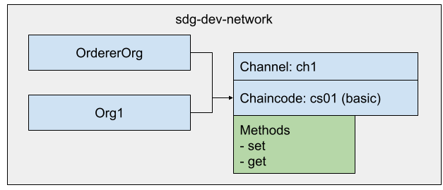

# Installing the sdg-dev-network
The **sdg-dev-network** is optimized for this course and not suitable for productive use. It is based on the test-network but reduced for the usage of this course. Figure 4 shows its components. 

The sdg-dev-network consists of one orderer and one peer node, a channel called **ch1** and a predefined chaincode called **basic**. The chaincode stores simply a key and a value. There are two chaincode functions available: a set function to create and update an asset in the blockchain and a get function to query the latest state of an existing asset.

<figure class="image">
  
  <figcaption>Figure 4</figcaption>
</figure>

The following steps are required to get started with the dev-network.

You need three terminals to run the network. Use tmux or three different ssh terminals.

>tmux is a terminal multiplexer. With it you can switch easily between several programs in one terminal, detach them (they keep running in the background) and reattach them to a different terminal.

In this course use tmux because of its ability to detach and reattach a program to the terminal window.

Use the sdg-dev-network for the following development use-cases:

- Chaincode development, certificates generated with cryptogen
  - Chaincode development with levelDb as state database
  - Chaincode development with CouchDb as state database
- Chaincode development, certificates generated with fabric-ca
  - Chaincode development with levelDb as state database
  - Chaincode development with CouchDb as state database

Before <ou can use it you have to install it.

## Installation and First Try

The sdg-dev-network can be cloned from the course repository.

```bash
# switch into the base install folder
cd fabric

# clone the repository
git clone git@sun.samlinux.at:/opt/git/sdg-dev-network.git

# switch into the network folder
cd sdg-dev-network
```

The sdg-dev-network is sumerized as follows:

- A total of three different terminals is needed, with tmux they are called panels.
- Panel 1 is running the docker compose network.
- Panel 2 is running the chaincode.
- Panel 3 is used to interact with the sdg-dev-network.

The typical start-up process of the sdg-dev-network consists of the following steps:

- Create a new tmux session.
- Start the sdg-dev-network.
- Split the panel and create a new panel, the second panel. Now you have two panels in one terminal running.
- Switch into the chaincode folder.
- Start the chaincode. This is also the place to stop and restart the chaincode every time if you make a change to the chaincode. After a restart of the chaincode you have immediate access to your channels you have created.
- Split the panel again and create another new panel, the third panel.
- The third panel is used for testing the chaincode. To interact with the network you have to set proper environment variables.
- Use the peer chaincode command with the subcommand query or invoke to call the chaincode functions.
- Detach from the tmux session if you have finished your work. But the network is still running in the background and you can come back later to continue work.

After understanding the basic process, you can take the following steps in sequence.

Before you start, get familiar with some tmux commands you are going to use. 

>**Create a new tmux session**<br> 
tmux new -s dev

>**Create a new panel horizontally**<br> 
CTRL + b " (double-quots)

>**Switch/select panel by number**<br> 
CTRL + b q  0 ... 9

>**Detach from session**<br> 
CTRL + b d 

>**Show all sessions**<br> 
tmux ls

>**Attach to session dev**<br> 
tmux att -t dev

>**Delete/kill session dev**<br> 
tmux kill-ses -t mysession

## Panel 1

```bash
# start new tmux session
tmux new -s dev

# start the network
./devNetwork.sh up
```
At this time the sdg-deb-network is running.

Split the panel 1 and create panel 2.
```bash
CTRL + b " 
```

## Panel 2
In panel 2 start and stop the chaincode itself.

```bash
# switch to the chaincode folder
cd chaincode/nodejs/sacc

# install all dependencies only for the first time
npm install 

# start the chaincode
CORE_CHAINCODE_LOGLEVEL=debug CORE_PEER_TLS_ENABLED=false CORE_CHAINCODE_ID_NAME=mycc:1.0 ./node_modules/.bin/fabric-chaincode-node start --peer.address 127.0.0.1:7052
```

Split panel 2 and create panel 3.
```bash
CTRL + b " 
```

## Panel 3
In panel 3use the chaincode with CLI commands.

```bash
# load and set environment variables for Org1
source org1.sh
setGlobals

### test the chaincode

# Create a new asset
CORE_PEER_ADDRESS=127.0.0.1:7051 peer chaincode invoke -o 127.0.0.1:7050 -C ch1 -n mycc -c '{"Args":["set","k1","Hello World!"]}'

# Query the new asset
CORE_PEER_ADDRESS=127.0.0.1:7051 peer chaincode query -o 127.0.0.1:7050 -C ch1 -n mycc -c '{"Args":["get","k1"]}' | jq .
```

Congratulations! You have successfully installed and tested the sdg-dev-network. Try to recap all the steps and play around with the chaincode.


## Detach from the Session
To leave the session use the following tmux command.

```bash
CTRL + b d
```

## Attach to the Dev Session Again
Get back to work by attaching to the session.

```bash
tmux att -t dev
```

>One final note: When you restart your machine then all tmux sessions are deleted.


[Index](./index.md)
