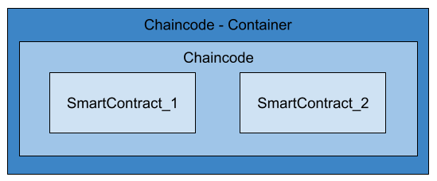

# Getting started with Chaincode development

Before you can start developing a new chaincode, you should understand what it takes to create a Node.js chaincode.

Let's start with a few terms: smart contract, chaincode and chaincode container. What is the difference between these terms and how they belong together?

Figure 5 shows the relationships.

<figure class="image">
  
  <figcaption>Figure 5</figcaption>
</figure>

A chaincode in terms of HLF can summarize different smart contracts. This chaincode is executed in a chaincode container assigned to a particular endorsement peer.

>Note: An endorsement peer is a peer on which chaincode has been installed.

Smart contracts are executable code, in our case written in Node.js. We can write different smart contracts which belongs to your use case or business model and pack it together to a chaincode. This is done during the packaging process when the chaincode is installed by an administrator of the network.

When the chaincode is finally started, it is executed in isolation in its own container and uniquely assigned to its endorsement peer.

To interact with the ledger there are two APIs available. First the so-called 

- fabric-shim and second the 
- fabric-contract-api.

>A ledger consists of two distinct, though related, parts – a “blockchain” and the “state database”, also known as “world state”. Unlike other ledgers, blockchains are immutable – that is, once a block has been added to the chain, it cannot be changed. In contrast, the “world state” is a database containing the current value of the set of key-value pairs that have been added, modified or deleted by the set of validated and committed transactions in the blockchain.

Either can be used. The fabric-shim API is the older one and provides a lower level chaincode interface. The fabric-contract-api is the current implementation and provides a high-level API for writing smart contracts. It also provides the implementation of the fabric-shim API to ensure compatibility with previous versions of Hyperledger Fabric. The fabric-contract-api is also the version that we will focus on in this course.

[Index](./index.md)