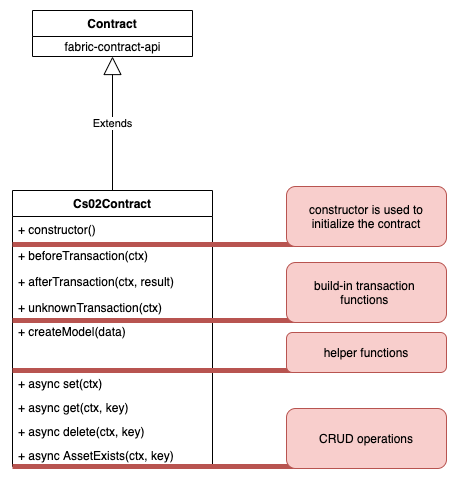

# CRUD operation

After understanding some theoretical background, we can examine the anatomy of a smart contract.

Let's do it with a practical example. In our first use case we want to store an asset with the following properties where the number is used as a key.

- Number
- Desc
- Amount and 
- Price

We can use this data model to learn how you can do CRUD (create, read, update, and delete) operations.

Figure 6 describes the context. Every smart contract must extends the contract class from the fabric-contract-api NPM packet.

<figure class="image">
  
  <figcaption>Figure 6</figcaption>
</figure>

We can split the Cs02Contract class in four areas. 

1. The constructor
2. The transaction functions
3. Some helper functions
4. CRUD operation functions


## Preparations
Before we start coding we have to setup the smart contract folder. This folder is placed in a subfolder of the chaincode folder in your sdg-dev-network folder. All contract relevant information is managed in this folder.

You can start with a standard package.json file for dependencies and the chaincode start command.

Follow the next steps to create the base folder structure.

```bash
# switch to the target folder
cd chaincode/nodejs

# create the contract folder and switch into it
mkdir cs02 && cd cs02

# create a package.json file
npm init -y
```

Now you should have a package.json file into the contract folder. Run the following command to verify that.

```bash
cat package.json
```

```bash
{
  "name": "cs02",
  "version": "1.0.0",
  "description": "",
  "main": "index.js",
  "scripts": {
    "test": "echo \"Error: no test specified\" && exit 1"
  },
  "keywords": [],
  "author": "",
  "license": "ISC"
}
```

Well done, at this time we are ready to install the dependencies we need. As I have mentioned for a basic contract implementation with Node.js we need at least the following two npm packages:

- fabric-contract-api
- fabric-shim

Fabric-contract-api is the main NPM package you need. Fabric-shim is needed to start the contract on the peer.

You can install these dependecies with the following command:

```bash
npm install --save fabric-contract-api fabric-shim
```

Congratulations, you have successfully finished the preparation part, let's start coding. 

## Basic structure of a contract
To get started we need at least two files. index.js and cs02.js.

Index.js is our main starting file. Create a new index.js file with your editor of your choice and fill in the following content.


```bash
'use strict';
#  import our contract
const cs02Contract = require('./cs02.js');

# export all contracts as an array
module.exports.contracts = [cs02Contract];
```

This exports a class that makes up the contract. But you can also split the contract into several classes and export it with the array.

>Note that the **contracts** word is mandatory in the module.exports statement.

As next step you can create another new file called cs02.js. In this file you can put your contract logic. 

Fill in the following content:

```bash
'use strict';

// SDK Library to asset with writing the logic 
const { Contract } = require('fabric-contract-api');

/**
 * my first contract
 */
class Cs02Contract extends Contract {
    constructor(){
      super('Cs02Contract');
    }

    /**
     * @param ctx 
     */
    beforeTransaction(ctx) {
      // default implementation is do nothing
      const txId = ctx.stub.txId;
      console.log('---------------------------');
      console.log('transaction start');
      console.log(`TxId: ${txId}`);
    }

    /**
     * @param ctx 
     * @param result 
     */
    afterTransaction(ctx, result) {
      console.log('transaction done, R: ',result);
      console.log('---------------------------');
    }

    /**
     * @param ctx 
     */
    unknownTransaction(ctx) {
      //Sending error message back to peer
      let ret = ctx.stub.getFunctionAndParameters();
      throw new Error(`CC method ${ret.fcn} not defined!`);
    }

    /**
     * This is a test function that can be removed later.
     * @param ctx 
     */
    test(ctx){
      console.log(`CC method ${ret.fcn} is called!`)
    }
};

module.exports = Cs02Contract
```

Let's discuss this first contract in detail. 

As a first step we have to import the SDK Library.

```bash
// SDK Library to asset with writing the logic 
const { Contract } = require('fabric-contract-api');
```

## The constructor
As a second step we need to define a class which extends the contract class from the fabric-contract-api. This class needs a constructor as a first function.

```bash
constructor(){
  super('Cs02Contract');
}
```

With the build-in function **super()** you sets a name so that the functions in this particular class can be separated from others. super calls the parent constructor, in this case the contract class of the contract-fabric-api is called.

If a name is given in the constructor then it will be prefixed separated by a : (colon). A formal definition is shown below.

```bash
[name:]functionname
```

This is useful in the case you want to separate your contract functions in different contract classes. A typical CLI contract call in the sdg-dev-network is shown below.

```bash
CORE_PEER_ADDRESS=127.0.0.1:7051 peer chaincode query -o 127.0.0.1:7050 -C ch1 -n mycc -c '{"Args":["Cs02Contract:test"]}' | jq .
```

You can see further that this class exports the Cs02Contract class. The class itself extends the Contract class from the fabric-contract-api.

## The transaction functions

In this first contract we have three more functions which are interesting.

- beforeTransaction
- afterTransaction
- unknownTransaction

These are so called transaction functions. **beforeTransaction(ctx)** is the starting point and **afterTransaction(ctx, result)** markes the endpoint of the transaction.

The **unknownTransaction()** function is triggered if the client calls a function which is not defined or not public. We can use this function to send a custom error message for the client or to do some logging.

In the contract class we can define when a function is callable through the client application or not. This is done through the function name.

A function name e.g **async get(ctx)** would be public and therefore callable for a client application.

A function name, e.g. **_getData(ctx)** is NOT public and cannot be called by a client application. Such a function can only be called in the contract itself and is also known as a private function.

So the differnence between public and private functions is the **underline**. Keep that in mind when you writing your own functions and contracts.


## Some helper fuctions
In order to be able to store or request data in the ledger, we have to transfer various data to the contract.

>The ledger is the sequenced, tamper-resistant record of all state transitions. State transitions are a result of chaincode invocations (“transactions”) submitted by participating parties. 

First you can pass all values as single parameters to the function. This approach can seem a bit confusing, because of too many parameters. Another method could be pass all values as a JSON string to the contract. In this second approach you have to pass less parameters to the contract.

Let's see how we need to pass values into the contract. In the sdg-dev network, for example, this is done using the CLI command **peer chaincode invoke**. This command has a **-c option** to pass the values.

See the following one-line example.
```bash
CORE_PEER_ADDRESS=127.0.0.1:7051 peer chaincode invoke -o 127.0.0.1:7050 -C ch1 -n mycc -c '{"Args":["set","{\"no\":\"a1\", \"desc\":\"Product number xx\",\"amount\":100, \"price\":10.50}"]}'
```

The **-c option** expects a JSON string. The JSON string represents an object with an argument named **Args**. This argument is a string array, where the first element at position 0 represents the function name to be called and the remaining values are the values to be transferred.

```bash
-c {"Args":["class:function name", "property 1", "property x"]}
```

In fabric we store data as an asset on the ledger. Each transaction results in a set of asset key-value pairs that are committed to the ledger as creates, updates, or deletes.

In general, to store an asset on the ledger you need to pass at least two parameters, a key and a value. The key represents an ID that uniquely identifies the asset. The second value is the value assigned to that asset. More technically speaking, the value is represented as raw binary data.

That`s why the associated value of an asset can be a simple string, an integer, a boolean or a complex data structure.

In Node.js the Buffer class was desinged to handle binary data. That is why we can convert values to binary data and as well back.


## CRUD operations

In computer programming there are four basic functions to store persistent data they are summarized as **CRUD** operations. CRUD stands for create, read, update, and delete.

In terms of HLF, the CRUD operations are related to the last version of an asset. This version is also called the **world state** of an asset.

According to the HLF documentation the world state is described as follows.
>The world state holds the current value of the attributes of a business object as a unique ledger state. That’s useful because programs usually require the current value of an object; it would be cumbersome to traverse the entire blockchain to calculate an object’s current value – you just get it directly from the world state.


### Create function


### Read function
After creating a new asset you can query the latest state of this asset.

```bash
/**
  * get the latest value of a key
  * 
  * @param {*} ctx 
  * @param {*} key 
  */
  async get(ctx, key){
    // get the asset from chaincode state
    const assetAsBuffer = await ctx.stub.getState(key); 

    // check if the asset key was found
    if (!assetAsBuffer || assetAsBuffer.length === 0) {
      throw new Error(`The asset ${key} does not exist`);
    }

    // convert the buffer (raw binary data) to string
    return assetAsBuffer.toString('utf8');
  }
```

### Update function

### Delete function

[Index](./index.md)